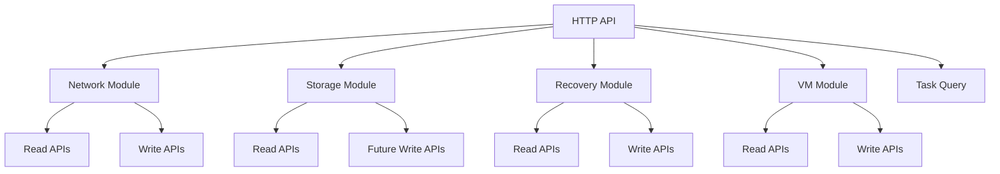
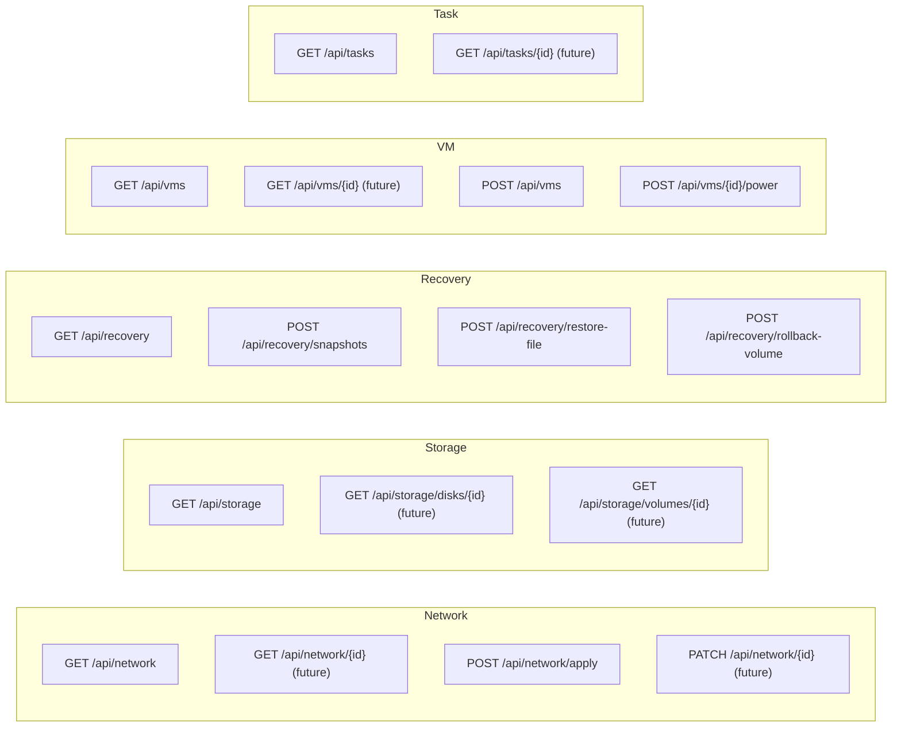
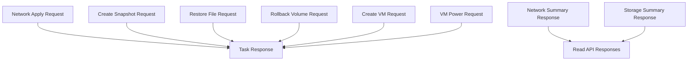

# NAS 模块接口清单图与输入输出对象图

这份文档的目的，是把项目继续往前推进时最容易混乱的两件事定下来：

1. 每个模块到底暴露哪些接口
2. 每个接口的输入输出对象长什么样

这样后面我们继续编码时，就不会一边写一边改方向。

---

## 1. 模块接口总览图



---

## 2. 当前推荐模块划分

### `network`

负责：

- 读取网卡配置
- 修改网络配置
- 生成执行计划
- 生成回滚计划
- 探活与回滚

### `storage`

负责：

- 读取磁盘信息
- 读取卷信息
- 读取挂载信息
- 后续扩展到健康检查、容量检查、扩容检查

### `recovery`

负责：

- 快照读取
- 创建快照
- 文件恢复
- 卷回滚
- 恢复记录

### `vm`

负责：

- 读取 VM 列表
- 创建 VM
- VM 电源操作
- 后续扩展到模板、快照、克隆

### `task`

负责：

- 查询任务列表
- 查询任务状态
- 后续扩展到任务详情、任务取消、任务重试

---

## 3. 接口清单图



---

## 4. 输入输出对象关系图



这张图的意思是：

- 读取类接口返回“状态对象”
- 修改类接口返回“任务对象”

这是 NAS 系统很重要的一个统一设计。

---

## 5. 接口详细清单

## 5.1 Network 模块

### `GET /api/network`

用途：

- 获取当前网络配置
- 给修改前检查提供基线
- 给修改后结果比对提供依据

返回对象：

```json
{
  "interfaces": [
    {
      "id": "eth0",
      "name": "LAN 1",
      "mode": "static",
      "ipv4": "192.168.10.20",
      "mask": "255.255.255.0",
      "gateway": "192.168.10.1",
      "dns": ["223.5.5.5", "8.8.8.8"],
      "link": "up",
      "bridge": "br0"
    }
  ],
  "history": []
}
```

### `POST /api/network/apply`

用途：

- 应用网络配置
- 返回任务状态

输入对象：

```json
{
  "nicId": "eth0",
  "mode": "static",
  "ipv4": "192.168.10.30",
  "mask": "255.255.255.0",
  "gateway": "192.168.10.1",
  "dns": ["223.5.5.5", "1.1.1.1"],
  "simulateFailure": false
}
```

输出对象：

```json
{
  "id": "task-0001",
  "module": "network",
  "action": "apply_profile",
  "status": "success",
  "progress": 100,
  "steps": [],
  "result": {
    "profile": {},
    "plan": {},
    "detail": ""
  }
}
```

### 未来建议新增

- `GET /api/network/{id}`
- `PATCH /api/network/{id}`
- `GET /api/network/plans/{taskId}`

---

## 5.2 Storage 模块

### `GET /api/storage`

用途：

- 获取当前磁盘和卷信息
- 作为恢复、扩容、迁移前的基线

返回对象：

```json
{
  "disks": [
    {
      "id": "disk-001",
      "name": "/dev/sda",
      "sizeGb": 512,
      "fileSystem": "ext4",
      "mountPoint": "/",
      "health": "healthy",
      "role": "system"
    }
  ],
  "volumes": [
    {
      "id": "volume1",
      "name": "system-volume",
      "fileSystem": "ext4",
      "mountPoint": "/",
      "usedGb": 42,
      "totalGb": 512,
      "raid": "single"
    }
  ]
}
```

### 未来建议新增

- `GET /api/storage/disks/{id}`
- `GET /api/storage/volumes/{id}`
- `GET /api/storage/health`
- `POST /api/storage/scan`

---

## 5.3 Recovery 模块

### `GET /api/recovery`

用途：

- 获取快照列表
- 获取恢复记录

返回对象：

```json
{
  "snapshots": [],
  "recoveries": []
}
```

### `POST /api/recovery/snapshots`

输入对象：

```json
{
  "volume": "volume1",
  "name": "nightly-snapshot"
}
```

输出对象：

- 标准 `Task Response`

### `POST /api/recovery/restore-file`

输入对象：

```json
{
  "snapshotId": "snap-system-001",
  "sourcePath": "/srv/nas/team/roadmap.xlsx",
  "targetPath": "/srv/nas/restore/roadmap.xlsx"
}
```

输出对象：

- 标准 `Task Response`

### `POST /api/recovery/rollback-volume`

输入对象：

```json
{
  "snapshotId": "snap-system-001",
  "volume": "volume2"
}
```

输出对象：

- 标准 `Task Response`

### 未来建议新增

- `GET /api/recovery/snapshots/{id}`
- `GET /api/recovery/records/{id}`
- `POST /api/recovery/verify`

---

## 5.4 VM 模块

### `GET /api/vms`

用途：

- 获取 VM 列表
- 获取模板列表

返回对象：

```json
{
  "templates": [],
  "vms": []
}
```

### `POST /api/vms`

输入对象：

```json
{
  "name": "linux-vm-demo",
  "cpu": 2,
  "memoryGb": 4,
  "diskGb": 50,
  "networkId": "eth0",
  "template": "Ubuntu 24.04 Base"
}
```

输出对象：

- 标准 `Task Response`

### `POST /api/vms/{id}/power`

输入对象：

```json
{
  "action": "start"
}
```

输出对象：

- 标准 `Task Response`

### 未来建议新增

- `GET /api/vms/{id}`
- `POST /api/vms/{id}/snapshot`
- `POST /api/vms/{id}/clone`

---

## 5.5 Task 模块

### `GET /api/tasks`

用途：

- 获取所有任务
- 统一查看修改类操作结果

返回对象：

```json
[
  {
    "id": "task-0001",
    "module": "network",
    "action": "apply_profile",
    "status": "success",
    "progress": 100,
    "steps": [],
    "result": {}
  }
]
```

### 未来建议新增

- `GET /api/tasks/{id}`
- `POST /api/tasks/{id}/retry`
- `POST /api/tasks/{id}/cancel`

---

## 6. 统一对象模型建议

## 6.1 读取类接口

读取类接口应该返回：

- 当前状态对象
- 不走任务包装

适用：

- `GET /api/network`
- `GET /api/storage`
- `GET /api/recovery`
- `GET /api/vms`

## 6.2 修改类接口

修改类接口应该统一返回：

- `Task Response`

原因：

- NAS 修改类操作是高风险动作
- 需要记录步骤
- 需要错误信息
- 可能需要回滚

---

## 7. 当前最推荐的开发顺序

```text
1. 做完整读取类 API
   - GET /api/network
   - GET /api/storage
   - GET /api/recovery
   - GET /api/vms

2. 做精细化读取接口
   - GET /api/network/{id}
   - GET /api/storage/disks/{id}
   - GET /api/storage/volumes/{id}
   - GET /api/vms/{id}

3. 再强化修改类 API
   - PATCH /api/network/{id}
   - POST /api/recovery/restore-file
   - POST /api/vms/{id}/power

4. 最后接真实 Linux / Btrfs / libvirt
```

---

## 8. 一句话总结

这套项目最核心的接口设计原则是：

- `读取类接口` 用来拿当前真实配置
- `修改类接口` 用来发起任务
- `任务接口` 用来查看执行过程和结果

如果一直守住这个原则，后面系统就会越做越稳。

